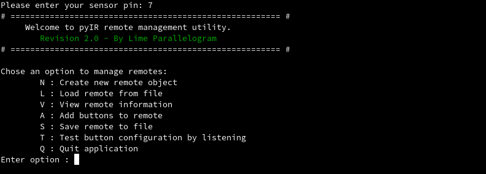

# pyIR - IR Remote Control Code Decoder

> ##### ⚠️ *Note - This software has been modified since its demonstration in the original YouTube video. Please enjoy these improvements or find the original software in the `old` directory.  

> ##### ⚠️ *This software if for execution on Raspberry Pi and other similar devices.

***
**pyIR** is a neat, object oriented library and helper program for making use of infrared receivers with a Raspberry Pi. Find accompanying YouTube video here: https://www.youtube.com/watch?v=KhiqINyHx08

This repository contains the following components:
 - pyIR.py : A custom-written library that can be used in your own projects to interact with IR remotes
 - CLI.py : A command line utility for retrieving button codes from IR remotes
 - GUI.py : A graphical utility for retrieving button codes from IR remotes (warning, this has not benefitted from updates yet)

### Current limitations:
Unfortunately, only remotes that use the NEC Protocol are currently supported. Hopefully more support will be introduced soon.

***
### CLI Application:

Load or create a remote object in order to use the other functions. Once you have created a remote object, you may record button codes from your receiver and then save the remote to a file. This definition file can then be used latterly in your own program.

***
### pyIR (module):
This is a custom module which you may use in your own programs. Place the pyIR.py file in your project folder and include ```import pyIR``` at the top of your program.

#### Basic functions:
- Create a receiver object. This represents your physical sensor.  
``` mySensor = pyIR.Receiver(pin) ```  
*pin* : int - pin number (GPIO.BOARD mode)
- Create a remote object. A remote will contain a information about different buttons that a remote contains.  
``` myRemote = pyIR.Remote(name, protocol) ```  
*name* - String identifier for remote  
*protocol* - Protocol class (currently only pyIR.NEC)
- Create a remote object using information from specified file.  
```myRemote = loadRemote(filename) ```  
*filename* : path of data file

#### Receiver functions:
- ``` getRaw() ``` - Get raw data from sensor in the format (digital state, length (ms))
- ``` listen(remotes=[]) ``` - Listen for incoming data and reference against all buttons in specified remotes

#### Remote functions:
- ``` recordButton(Receiver, buttonNickname) ``` - Record button using the specified receiver object
- ``` displayButtons(self) ``` - Print a tabular representation of all buttons in the remote
- ``` saveRemote(filename) ``` - Save the remote object to a text file with the specified path
- ``` identifyButton(binary) ``` - Return the button object whose binary value matches the provided value